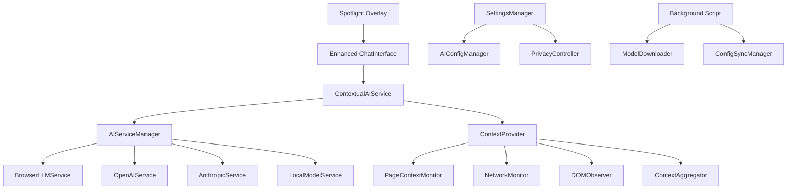
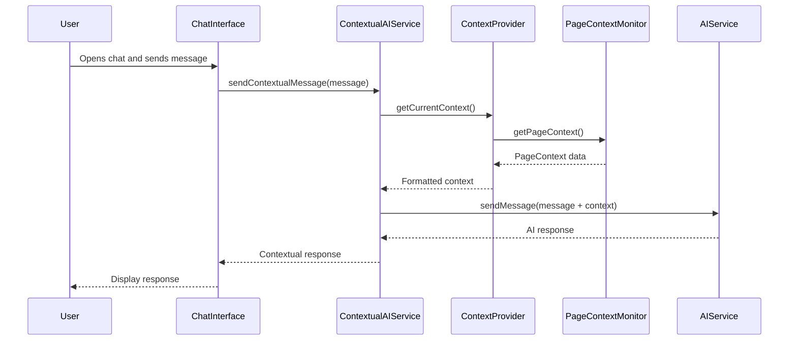

# Design Document

## Overview

The Contextual AI Integration system creates a comprehensive bridge between the existing page context monitoring infrastructure and the AI chat interface, enabling intelligent, context-aware conversations. The system supports multiple AI backends including browser-based LLMs for offline operation and user-configurable external services for enhanced capabilities.

## Architecture

### High-Level Architecture



### Component Integration Flow



## Components and Interfaces

### Core Integration Components

#### ContextualAIService

- **Purpose**: Main orchestrator that combines user messages with page context and manages AI interactions
- **Responsibilities**:
  - Integrate user messages with current page context
  - Format context data for AI consumption
  - Handle AI service selection and fallback logic
  - Manage conversation context and history

```typescript
class ContextualAIService {
  private aiServiceManager: AIServiceManager;
  private contextProvider: ContextProvider;
  private conversationContext: Map<string, ConversationContext>;

  constructor(
    aiServiceManager: AIServiceManager,
    contextProvider: ContextProvider
  );

  async sendContextualMessage(
    message: string,
    conversationId: string,
    options?: ContextualMessageOptions
  ): Promise<AIServiceResponse>;

  async sendContextualMessageStream(
    message: string,
    conversationId: string,
    onChunk: (chunk: string) => void,
    options?: ContextualMessageOptions
  ): Promise<AIServiceResponse>;

  async generateContextualSuggestions(): Promise<ContextualSuggestion[]>;

  setContextOptions(options: ContextOptions): void;
  getContextSummary(): ContextSummary;
}
```

#### Enhanced ContextProvider

- **Purpose**: Extends existing ContextProvider to format data specifically for AI consumption
- **Features**:
  - Smart context prioritization based on user query
  - Context summarization for token efficiency
  - Privacy-aware context filtering
  - Real-time context updates

```typescript
class EnhancedContextProvider extends ContextProvider {
  private contextFormatter: ContextFormatter;
  private privacyController: PrivacyController;

  async getAIFormattedContext(
    query?: string,
    options?: ContextOptions
  ): Promise<FormattedContext>;

  async getContextSummary(maxTokens?: number): Promise<ContextSummary>;

  prioritizeContextForQuery(
    context: PageContext,
    query: string
  ): PrioritizedContext;

  filterContextForPrivacy(context: PageContext): PageContext;
}
```

#### BrowserLLMService

- **Purpose**: Implements browser-based LLM using WebGPU/WebAssembly for offline AI capabilities
- **Implementation**: Uses libraries like Transformers.js or ONNX.js for in-browser inference
- **Features**:
  - Local model loading and caching
  - WebGPU acceleration when available
  - Efficient memory management
  - Progressive model loading

```typescript
class BrowserLLMService extends AIService {
  private model: any;
  private tokenizer: any;
  private isLoaded: boolean = false;
  private loadingPromise?: Promise<void>;

  async loadModel(modelName?: string): Promise<void>;
  async unloadModel(): void;

  async sendMessage(
    message: string,
    context?: ChatMessage[]
  ): Promise<AIServiceResponse>;

  async sendMessageStream(
    message: string,
    context?: ChatMessage[],
    onChunk?: (chunk: string) => void
  ): Promise<AIServiceResponse>;

  getModelInfo(): ModelInfo;
  getMemoryUsage(): MemoryUsage;
}
```

#### AIConfigManager

- **Purpose**: Manages AI service configuration, API keys, and model selection
- **Features**:
  - Secure API key storage
  - Model capability detection
  - Configuration validation
  - Service health monitoring

```typescript
class AIConfigManager {
  private storage: SecureStorage;
  private serviceRegistry: Map<string, AIServiceConfig>;

  async saveServiceConfig(
    serviceName: string,
    config: AIServiceConfig
  ): Promise<void>;

  async getServiceConfig(serviceName: string): Promise<AIServiceConfig>;

  async testServiceConnection(serviceName: string): Promise<boolean>;

  async getAvailableModels(serviceName: string): Promise<ModelInfo[]>;

  async validateApiKey(serviceName: string, apiKey: string): Promise<boolean>;

  getServiceCapabilities(serviceName: string): ServiceCapabilities;
}
```

### AI Service Implementations

#### OpenAIService

```typescript
class OpenAIService extends AIService {
  private client: OpenAI;

  constructor(config: OpenAIConfig) {
    super(config);
    this.client = new OpenAI({
      apiKey: config.apiKey,
      baseURL: config.baseUrl,
    });
  }

  async sendMessage(
    message: string,
    context?: ChatMessage[]
  ): Promise<AIServiceResponse>;

  async sendMessageStream(
    message: string,
    context?: ChatMessage[],
    onChunk?: (chunk: string) => void
  ): Promise<AIServiceResponse>;

  async validateConfig(): Promise<boolean>;

  getServiceInfo(): ServiceInfo;
}
```

#### AnthropicService

```typescript
class AnthropicService extends AIService {
  private client: Anthropic;

  constructor(config: AnthropicConfig) {
    super(config);
    this.client = new Anthropic({
      apiKey: config.apiKey,
    });
  }

  async sendMessage(
    message: string,
    context?: ChatMessage[]
  ): Promise<AIServiceResponse>;

  // Similar implementation to OpenAI but using Anthropic's API
}
```

### Context Processing Components

#### ContextFormatter

- **Purpose**: Formats raw page context into AI-consumable text
- **Features**:
  - Intelligent text summarization
  - Structured data extraction
  - Token-efficient formatting
  - Query-specific context selection

```typescript
class ContextFormatter {
  formatForAI(
    context: PageContext,
    query?: string,
    maxTokens?: number
  ): FormattedContext;

  summarizeContent(content: ContentSnapshot): string;

  formatNetworkActivity(activity: NetworkActivity[]): string;

  formatDOMChanges(changes: DOMChange[]): string;

  prioritizeContextElements(
    context: PageContext,
    query: string
  ): ContextElement[];
}
```

#### SuggestionEngine

- **Purpose**: Generates proactive contextual suggestions based on page analysis
- **Features**:
  - Pattern recognition for common tasks
  - Error detection and debugging suggestions
  - Form assistance recommendations
  - Data analysis suggestions

```typescript
class SuggestionEngine {
  private patternDetectors: Map<string, PatternDetector>;

  async generateSuggestions(
    context: PageContext
  ): Promise<ContextualSuggestion[]>;

  detectFormAssistanceOpportunities(context: PageContext): FormSuggestion[];

  detectDebuggingOpportunities(
    networkActivity: NetworkActivity[]
  ): DebuggingSuggestion[];

  detectDataAnalysisOpportunities(content: ContentSnapshot): DataSuggestion[];
}
```

## Data Models

### Core Data Structures

```typescript
interface FormattedContext {
  summary: string;
  content: {
    title: string;
    url: string;
    mainContent: string;
    forms: FormInfo[];
    tables: TableInfo[];
    links: LinkInfo[];
  };
  network: {
    recentRequests: NetworkRequestSummary[];
    errors: NetworkError[];
    apiEndpoints: string[];
  };
  interactions: {
    recentActions: UserAction[];
    focusedElements: ElementInfo[];
  };
  metadata: {
    pageType: string;
    technologies: string[];
    semanticData: SemanticSummary;
  };
  tokenCount: number;
}

interface ContextualMessageOptions {
  includeNetworkData?: boolean;
  includeDOMChanges?: boolean;
  includeInteractions?: boolean;
  maxContextTokens?: number;
  contextPriority?: ContextPriority;
}

interface ContextualSuggestion {
  id: string;
  type: "form-help" | "debug-assist" | "data-analysis" | "workflow";
  title: string;
  description: string;
  action?: SuggestionAction;
  confidence: number;
  context: ContextReference;
}

interface ConversationContext {
  id: string;
  messages: ChatMessage[];
  pageContext: PageContext;
  lastUpdated: Date;
  contextOptions: ContextOptions;
}

interface ModelInfo {
  name: string;
  size: string;
  capabilities: string[];
  requirements: {
    memory: number;
    webgpu?: boolean;
    wasm?: boolean;
  };
  downloadUrl?: string;
  localPath?: string;
}

interface ServiceCapabilities {
  streaming: boolean;
  contextLength: number;
  multimodal: boolean;
  functionCalling: boolean;
  codeGeneration: boolean;
}
```

### Configuration Models

```typescript
interface AIServiceConfig {
  type: "openai" | "anthropic" | "browser-llm" | "local";
  apiKey?: string;
  baseUrl?: string;
  model: string;
  temperature: number;
  maxTokens: number;
  contextLength: number;
  enabled: boolean;
  priority: number;
}

interface BrowserLLMConfig extends AIServiceConfig {
  modelPath?: string;
  useWebGPU: boolean;
  maxMemoryMB: number;
  offloadLayers?: number;
}

interface ContextOptions {
  includeContent: boolean;
  includeNetwork: boolean;
  includeDOMChanges: boolean;
  includeInteractions: boolean;
  maxTokens: number;
  privacyLevel: "strict" | "moderate" | "permissive";
}

interface PrivacySettings {
  excludedDomains: string[];
  redactSensitiveData: boolean;
  allowNetworkData: boolean;
  allowFormData: boolean;
  dataRetentionDays: number;
}
```

## Browser LLM Implementation

### Model Selection and Loading

#### Recommended Models

1. **Phi-3 Mini (3.8B)**: Lightweight, good for basic contextual tasks
2. **Gemma-2B**: Google's efficient small model
3. **TinyLlama (1.1B)**: Ultra-lightweight for basic assistance
4. **Qwen2-1.5B**: Good balance of size and capability

#### Loading Strategy

```typescript
class ModelManager {
  private static readonly MODELS = {
    "phi-3-mini": {
      name: "Phi-3 Mini",
      size: "2.4GB",
      url: "https://huggingface.co/microsoft/Phi-3-mini-4k-instruct-onnx",
      capabilities: ["chat", "reasoning", "code"],
    },
    "gemma-2b": {
      name: "Gemma 2B",
      size: "1.6GB",
      url: "https://huggingface.co/google/gemma-2b-it-onnx",
      capabilities: ["chat", "reasoning"],
    },
    tinyllama: {
      name: "TinyLlama",
      size: "637MB",
      url: "https://huggingface.co/TinyLlama/TinyLlama-1.1B-Chat-v1.0-onnx",
      capabilities: ["chat"],
    },
  };

  async downloadModel(
    modelName: string,
    onProgress?: (progress: number) => void
  ): Promise<void>;
  async loadModel(modelName: string): Promise<void>;
  async unloadModel(): Promise<void>;
  getAvailableModels(): ModelInfo[];
  getDownloadedModels(): string[];
}
```

### WebGPU Integration

```typescript
class WebGPUAccelerator {
  private device?: GPUDevice;
  private adapter?: GPUAdapter;

  async initialize(): Promise<boolean>;
  async createComputePipeline(shader: string): Promise<GPUComputePipeline>;
  async runInference(input: Float32Array): Promise<Float32Array>;
  isSupported(): boolean;
  getMemoryInfo(): GPUMemoryInfo;
}
```

## Integration Points

### Enhanced ChatInterface

The existing ChatInterface will be enhanced to support contextual AI:

```typescript
interface EnhancedChatInterfaceProps extends ChatInterfaceProps {
  contextualAIService: ContextualAIService;
  showContextSummary?: boolean;
  enableSuggestions?: boolean;
  contextOptions?: ContextOptions;
}

class EnhancedChatInterface extends React.Component<EnhancedChatInterfaceProps> {
  private contextualAI: ContextualAIService;

  async sendMessage(message: string): Promise<void> {
    // Enhanced to include context
    const response = await this.contextualAI.sendContextualMessage(
      message,
      this.conversationId,
      this.props.contextOptions
    );

    this.addMessage({
      content: response.message,
      sender: "ai",
      context: response.context,
    });
  }

  async loadSuggestions(): Promise<void> {
    const suggestions = await this.contextualAI.generateContextualSuggestions();
    this.setState({ suggestions });
  }
}
```

### Settings Integration

New settings panels will be added to the existing SettingsManager:

```typescript
interface AISettingsPanel {
  serviceSelection: AIServiceSelector;
  modelConfiguration: ModelConfigPanel;
  contextOptions: ContextOptionsPanel;
  privacyControls: PrivacyControlsPanel;
  browserLLMSettings: BrowserLLMPanel;
}
```

## Error Handling

### Service Fallback Chain

1. **Primary Service**: User-configured external AI service
2. **Secondary Service**: Alternative external service (if configured)
3. **Browser LLM**: Local browser-based model
4. **Basic Mode**: Simple context display without AI processing

### Error Scenarios

#### Network Failures

- **Detection**: API timeout or connection errors
- **Response**: Automatic fallback to browser LLM
- **User Feedback**: Notification of service switch

#### Model Loading Failures

- **Detection**: Browser LLM fails to load or initialize
- **Response**: Graceful degradation to basic context display
- **User Feedback**: Clear error message with troubleshooting steps

#### Context Collection Failures

- **Detection**: Monitoring system errors or privacy blocks
- **Response**: Continue with available context data
- **User Feedback**: Indicate limited context availability

#### Memory/Performance Issues

- **Detection**: High memory usage or slow responses
- **Response**: Reduce context size or switch to lighter model
- **User Feedback**: Performance optimization suggestions

## Testing Strategy

### Unit Testing

#### ContextualAIService Testing

- Context formatting and integration
- Service fallback logic
- Privacy filtering
- Error handling scenarios

#### BrowserLLMService Testing

- Model loading and unloading
- Inference accuracy
- Memory management
- WebGPU acceleration

#### Context Integration Testing

- PageContext to AI format conversion
- Real-time context updates
- Privacy compliance
- Performance impact

### Integration Testing

#### End-to-End Contextual Conversations

- User asks contextual questions
- AI responds with page-specific information
- Context updates during conversation
- Service switching scenarios

#### Multi-Service Testing

- External API integration
- Browser LLM fallback
- Configuration management
- Error recovery

### Performance Testing

#### Browser LLM Performance

- Model loading time
- Inference speed
- Memory usage
- Battery impact

#### Context Processing Performance

- Context collection overhead
- Formatting efficiency
- Real-time update performance
- Large page handling

### Privacy Testing

#### Data Handling Compliance

- Context filtering accuracy
- API key security
- Local data retention
- Cross-tab isolation

## Implementation Notes

### Browser LLM Libraries

#### Transformers.js Integration

```typescript
import { pipeline, env } from "@xenova/transformers";

// Configure for browser environment
env.allowRemoteModels = true;
env.allowLocalModels = true;

class TransformersJSService extends BrowserLLMService {
  private generator: any;

  async loadModel(modelName: string): Promise<void> {
    this.generator = await pipeline("text-generation", `Xenova/${modelName}`, {
      device: "webgpu",
    });
  }

  async generateText(prompt: string): Promise<string> {
    const result = await this.generator(prompt, {
      max_new_tokens: 512,
      temperature: 0.7,
      do_sample: true,
    });
    return result[0].generated_text;
  }
}
```

#### ONNX.js Integration

```typescript
import * as ort from "onnxruntime-web";

class ONNXService extends BrowserLLMService {
  private session: ort.InferenceSession;

  async loadModel(modelPath: string): Promise<void> {
    this.session = await ort.InferenceSession.create(modelPath, {
      executionProviders: ["webgpu", "wasm"],
    });
  }

  async runInference(inputIds: number[]): Promise<number[]> {
    const feeds = {
      input_ids: new ort.Tensor("int64", inputIds, [1, inputIds.length]),
    };
    const results = await this.session.run(feeds);
    return Array.from(results.logits.data as Float32Array);
  }
}
```

### Security Considerations

#### API Key Management

- Store API keys in browser's secure storage
- Encrypt sensitive configuration data
- Implement key rotation mechanisms
- Provide key validation and testing

#### Context Privacy

- Implement granular privacy controls
- Respect existing monitoring privacy settings
- Provide context preview before sending to AI
- Allow per-domain context exclusions

#### Browser LLM Security

- Validate model integrity before loading
- Implement resource usage limits
- Prevent model tampering
- Secure model storage and caching

### Performance Optimization

#### Context Efficiency

- Implement smart context summarization
- Use token counting for context limits
- Cache formatted context for repeated queries
- Prioritize relevant context based on query

#### Model Management

- Lazy load models only when needed
- Implement model caching strategies
- Use progressive loading for large models
- Optimize memory usage with model quantization

#### Network Optimization

- Implement request batching for external APIs
- Use streaming responses for better UX
- Cache AI responses for repeated queries
- Optimize context payload size

### Browser Compatibility

#### WebGPU Support

- Detect WebGPU availability
- Graceful fallback to WebAssembly
- Handle different GPU capabilities
- Optimize for mobile devices

#### Storage Requirements

- Implement efficient model storage
- Handle storage quota limitations
- Provide storage usage indicators
- Allow model cleanup and management

#### Cross-Browser Testing

- Chrome: Primary target with full WebGPU support
- Firefox: WebAssembly fallback
- Safari: Limited WebGPU, focus on efficiency
- Edge: Similar to Chrome capabilities
