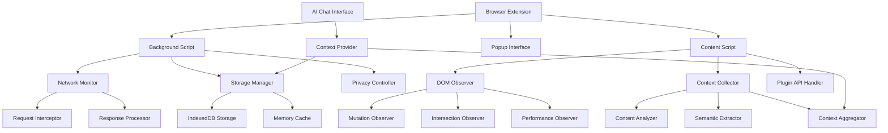
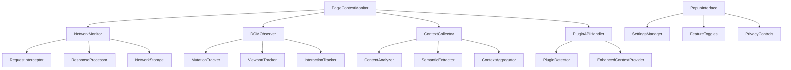

# Design Document

## Overview

The Page Context Monitoring System is a comprehensive extension to the Spotlight Browser Extension that provides contextual awareness through network activity monitoring, DOM observation, and page content analysis. The system is designed with a layered architecture that works universally across all websites while offering enhanced performance for sites implementing plugin-specific guidelines.

## Architecture

### High-Level Architecture



### Component Hierarchy



## Components and Interfaces

### Core Components

#### PageContextMonitor

- **Purpose**: Main orchestrator that coordinates all monitoring activities
- **Responsibilities**:
  - Initialize and manage all monitoring components
  - Handle enable/disable state changes
  - Coordinate data flow between components
  - Manage performance throttling and resource usage

```typescript
class PageContextMonitor {
  private networkMonitor: NetworkMonitor;
  private domObserver: DOMObserver;
  private contextCollector: ContextCollector;
  private pluginAPIHandler: PluginAPIHandler;
  private isEnabled: boolean = true;
  
  constructor(config: MonitoringConfig);
  enable(): void;
  disable(): void;
  getContext(): PageContext;
  updateConfig(config: Partial<MonitoringConfig>): void;
}
```

#### NetworkMonitor

- **Purpose**: Intercepts and processes network requests and responses
- **Implementation**: Uses Chrome's webRequest API and fetch/XMLHttpRequest interception
- **Features**:
  - Request/response capture with configurable filtering
  - Privacy-aware data redaction
  - Rolling buffer for recent activity
  - Performance optimization with request prioritization

```typescript
class NetworkMonitor {
  private requestBuffer: CircularBuffer<NetworkRequest>;
  private responseBuffer: CircularBuffer<NetworkResponse>;
  private privacyController: PrivacyController;
  
  startMonitoring(): void;
  stopMonitoring(): void;
  getRecentActivity(timeWindow?: number): NetworkActivity[];
  addFilter(filter: NetworkFilter): void;
  removeFilter(filterId: string): void;
}
```

#### DOMObserver

- **Purpose**: Monitors DOM changes, user interactions, and viewport changes
- **Implementation**: Uses MutationObserver, IntersectionObserver, and event listeners
- **Features**:
  - Efficient change detection with debouncing
  - Viewport and scroll tracking
  - Form interaction monitoring (privacy-aware)
  - Modal and overlay detection

```typescript
class DOMObserver {
  private mutationObserver: MutationObserver;
  private intersectionObserver: IntersectionObserver;
  private interactionTracker: InteractionTracker;
  
  startObserving(): void;
  stopObserving(): void;
  getCurrentLayout(): LayoutSnapshot;
  getVisibleContent(): VisibleContent;
  getRecentChanges(): DOMChange[];
}
```

#### ContextCollector

- **Purpose**: Analyzes and aggregates page content into structured context
- **Features**:
  - Content extraction and summarization
  - Semantic analysis of page structure
  - Data table and form analysis
  - Context prioritization and relevance scoring

```typescript
class ContextCollector {
  private contentAnalyzer: ContentAnalyzer;
  private semanticExtractor: SemanticExtractor;
  private contextAggregator: ContextAggregator;
  
  collectContext(): PageContext;
  analyzeContent(element: Element): ContentAnalysis;
  extractSemantics(): SemanticData;
  prioritizeContext(context: RawContext): PrioritizedContext;
}
```

#### PluginAPIHandler

- **Purpose**: Manages integration with websites that implement plugin guidelines
- **Features**:
  - Plugin detection and capability negotiation
  - Enhanced context provider registration
  - Structured data extraction from compliant sites
  - Performance optimization for plugin-enabled sites

```typescript
class PluginAPIHandler {
  private registeredProviders: Map<string, ContextProvider>;
  private pluginDetector: PluginDetector;
  
  detectPlugins(): PluginCapability[];
  registerProvider(provider: ContextProvider): void;
  getEnhancedContext(): EnhancedContext | null;
  negotiateCapabilities(plugin: PluginInfo): PluginCapability[];
}
```

### Background Script Components

#### NetworkInterceptor

- **Purpose**: Background script component for network request interception
- **Implementation**: Uses chrome.webRequest API for comprehensive network monitoring
- **Features**:
  - Request/response header capture
  - Payload extraction (with privacy controls)
  - Cross-origin request tracking
  - WebSocket and EventSource monitoring

#### StorageManager

- **Purpose**: Manages persistent and temporary storage of monitoring data
- **Implementation**: Uses IndexedDB for persistent storage and memory cache for active data
- **Features**:
  - Efficient data compression and serialization
  - Automatic cleanup and retention policies
  - Privacy-compliant data handling
  - Cross-tab data synchronization

### Popup Interface Components

#### SettingsManager

- **Purpose**: Manages extension configuration and user preferences
- **Features**:
  - Feature toggle management
  - Privacy setting configuration
  - Domain exclusion management
  - Export/import of settings

#### FeatureToggles

- **Purpose**: UI component for enabling/disabling monitoring features
- **Features**:
  - Master enable/disable toggle
  - Individual feature toggles (network, DOM, context)
  - Real-time status indicators
  - Performance impact indicators

## Data Models

### Core Data Structures

```typescript
interface PageContext {
  url: string;
  title: string;
  timestamp: Date;
  content: ContentSnapshot;
  layout: LayoutSnapshot;
  network: NetworkActivity[];
  interactions: UserInteraction[];
  semantics: SemanticData;
  plugin?: EnhancedContext;
}

interface ContentSnapshot {
  text: string;
  headings: Heading[];
  links: Link[];
  images: Image[];
  forms: Form[];
  tables: Table[];
  metadata: PageMetadata;
}

interface LayoutSnapshot {
  viewport: ViewportInfo;
  visibleElements: VisibleElement[];
  scrollPosition: ScrollPosition;
  modals: Modal[];
  overlays: Overlay[];
}

interface NetworkActivity {
  requests: NetworkRequest[];
  responses: NetworkResponse[];
  errors: NetworkError[];
  timeWindow: TimeWindow;
}

interface NetworkRequest {
  id: string;
  url: string;
  method: string;
  headers: Record<string, string>;
  body?: string;
  timestamp: Date;
  initiator: string;
  type: RequestType;
}

interface NetworkResponse {
  requestId: string;
  status: number;
  statusText: string;
  headers: Record<string, string>;
  body?: string;
  timestamp: Date;
  size: number;
}

interface UserInteraction {
  type: InteractionType;
  element: ElementInfo;
  timestamp: Date;
  context: InteractionContext;
}

interface SemanticData {
  schema: SchemaOrgData[];
  microdata: MicrodataItem[];
  jsonLd: JsonLdData[];
  openGraph: OpenGraphData;
  twitter: TwitterCardData;
  custom: CustomSemanticData[];
}

interface EnhancedContext {
  provider: string;
  version: string;
  capabilities: PluginCapability[];
  data: StructuredData;
  performance: PerformanceMetrics;
}
```

### Configuration Models

```typescript
interface MonitoringConfig {
  enabled: boolean;
  features: FeatureConfig;
  privacy: PrivacyConfig;
  performance: PerformanceConfig;
  storage: StorageConfig;
}

interface FeatureConfig {
  networkMonitoring: boolean;
  domObservation: boolean;
  contextCollection: boolean;
  pluginIntegration: boolean;
  interactionTracking: boolean;
}

interface PrivacyConfig {
  excludedDomains: string[];
  excludedPaths: string[];
  redactSensitiveData: boolean;
  sensitiveDataPatterns: RegExp[];
  dataRetentionDays: number;
}

interface PerformanceConfig {
  maxBufferSize: number;
  throttleInterval: number;
  maxConcurrentRequests: number;
  compressionEnabled: boolean;
}
```

### Plugin API Models

```typescript
interface PluginCapability {
  name: string;
  version: string;
  features: string[];
  performance: PerformanceLevel;
}

interface ContextProvider {
  id: string;
  name: string;
  version: string;
  getContext(): Promise<StructuredData>;
  getSchema(): ContextSchema;
  supportsRealtime(): boolean;
}

interface PluginGuidelines {
  contextAPI: {
    endpoint: string;
    authentication?: AuthConfig;
    schema: ContextSchema;
  };
  semanticMarkup: {
    required: string[];
    recommended: string[];
    custom: CustomMarkupSpec[];
  };
  performance: {
    cacheHeaders: boolean;
    compression: boolean;
    streaming: boolean;
  };
}
```

## Error Handling

### Network Monitoring Errors

- **Request Interception Failures**: Graceful degradation to passive monitoring
- **Response Processing Errors**: Log errors and continue with partial data
- **Storage Quota Exceeded**: Implement automatic cleanup and user notification
- **Privacy Filter Errors**: Fail-safe to exclude data rather than expose it

### DOM Observation Errors

- **Observer Disconnection**: Automatic reconnection with exponential backoff
- **Performance Degradation**: Dynamic throttling and feature disabling
- **Memory Leaks**: Automatic cleanup and garbage collection triggers
- **Cross-Frame Access**: Graceful handling of security restrictions

### Context Collection Errors

- **Content Analysis Failures**: Fallback to basic text extraction
- **Semantic Extraction Errors**: Continue with available semantic data
- **Plugin Integration Failures**: Fallback to universal monitoring
- **Data Corruption**: Validation and recovery mechanisms

### Storage and Privacy Errors

- **Storage Access Denied**: Fallback to memory-only operation
- **Privacy Filter Failures**: Err on the side of data exclusion
- **Cross-Tab Synchronization**: Handle conflicts with last-write-wins
- **Data Export/Import**: Validation and error reporting

## Testing Strategy

### Unit Testing

- **Component Isolation**: Test each monitoring component independently
- **Mock Dependencies**: Mock browser APIs and external dependencies
- **Error Scenarios**: Test error handling and recovery mechanisms
- **Performance Testing**: Validate throttling and resource management

### Integration Testing

- **End-to-End Monitoring**: Test complete monitoring pipeline
- **Cross-Component Communication**: Validate data flow between components
- **Browser API Integration**: Test with real browser APIs
- **Plugin Integration**: Test with mock and real plugin implementations

### Performance Testing

- **Memory Usage**: Monitor memory consumption under various loads
- **CPU Impact**: Measure performance impact on page rendering
- **Network Overhead**: Validate minimal impact on network performance
- **Storage Efficiency**: Test data compression and cleanup mechanisms

### Privacy Testing

- **Data Redaction**: Validate sensitive data filtering
- **Domain Exclusion**: Test privacy controls effectiveness
- **User Consent**: Validate opt-in/opt-out mechanisms
- **Data Retention**: Test automatic cleanup and retention policies

## Implementation Notes

### Browser API Requirements

#### Manifest V3 Permissions

```json
{
  "permissions": [
    "activeTab",
    "storage",
    "webRequest",
    "webNavigation",
    "scripting"
  ],
  "host_permissions": [
    "<all_urls>"
  ],
  "background": {
    "service_worker": "background.js"
  },
  "content_scripts": [
    {
      "matches": ["<all_urls>"],
      "js": ["content.js"],
      "run_at": "document_start"
    }
  ]
}
```

#### Network Monitoring Implementation

- **webRequest API**: For comprehensive request/response interception
- **Fetch/XMLHttpRequest Patching**: For client-side request monitoring
- **Performance API**: For timing and resource usage data
- **Service Worker**: For background network monitoring

#### DOM Observation Implementation

- **MutationObserver**: For DOM change detection
- **IntersectionObserver**: For viewport and visibility tracking
- **ResizeObserver**: For layout change detection
- **Event Listeners**: For user interaction tracking

### Performance Optimization Strategies

#### Efficient Data Collection

- **Debouncing**: Batch DOM changes to reduce processing overhead
- **Throttling**: Limit monitoring frequency during high activity
- **Prioritization**: Focus on relevant changes and interactions
- **Lazy Loading**: Load analysis components only when needed

#### Memory Management

- **Circular Buffers**: Implement fixed-size buffers for recent data
- **Data Compression**: Compress stored data to reduce memory usage
- **Garbage Collection**: Proactive cleanup of unused data
- **Weak References**: Use weak references where appropriate

#### Storage Optimization

- **IndexedDB**: Use for persistent storage with efficient querying
- **Compression**: Implement data compression for storage efficiency
- **Cleanup Policies**: Automatic cleanup based on age and relevance
- **Batch Operations**: Batch storage operations for better performance

### Plugin Integration Guidelines

#### Website Implementation

```javascript
// Plugin registration example
window.spotlightPlugin = {
  version: '1.0.0',
  capabilities: ['context', 'realtime', 'semantic'],
  
  getContext: async () => {
    return {
      type: 'ecommerce',
      products: getCurrentProducts(),
      user: getCurrentUser(),
      cart: getCartContents(),
      recommendations: getRecommendations()
    };
  },
  
  getSchema: () => ({
    type: 'object',
    properties: {
      products: { type: 'array' },
      user: { type: 'object' },
      cart: { type: 'object' }
    }
  }),
  
  onContextRequest: (callback) => {
    // Register for real-time context updates
    window.addEventListener('contextChange', callback);
  }
};
```

#### Semantic Markup Guidelines

```html
<!-- Enhanced semantic markup for better context extraction -->
<div data-spotlight-context="product-list">
  <article data-spotlight-item="product" data-id="123">
    <h2 data-spotlight-field="name">Product Name</h2>
    <span data-spotlight-field="price">$99.99</span>
    <div data-spotlight-field="description">Product description</div>
  </article>
</div>

<!-- Schema.org integration -->
<script type="application/ld+json">
{
  "@context": "https://schema.org",
  "@type": "Product",
  "name": "Product Name",
  "offers": {
    "@type": "Offer",
    "price": "99.99",
    "priceCurrency": "USD"
  }
}
</script>
```

### Security Considerations

#### Content Security Policy

- **CSP Compliance**: Ensure monitoring code works with strict CSP
- **Nonce Support**: Support CSP nonces for dynamic script injection
- **Sandbox Restrictions**: Handle sandboxed iframe limitations

#### Privacy Protection

- **Data Minimization**: Collect only necessary data for context
- **Encryption**: Encrypt sensitive data in storage
- **Access Controls**: Implement proper access controls for stored data
- **Audit Logging**: Log access to sensitive monitoring data

#### Cross-Origin Security

- **Same-Origin Policy**: Respect browser security boundaries
- **CORS Handling**: Properly handle cross-origin requests
- **Frame Security**: Handle cross-frame communication securely
- **Postmessage Validation**: Validate all postMessage communications