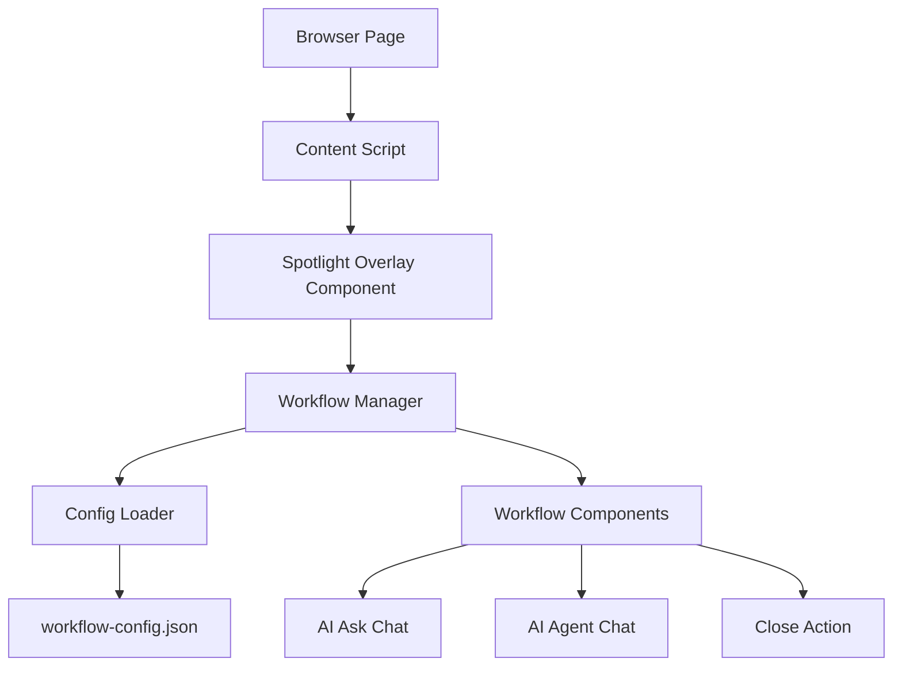
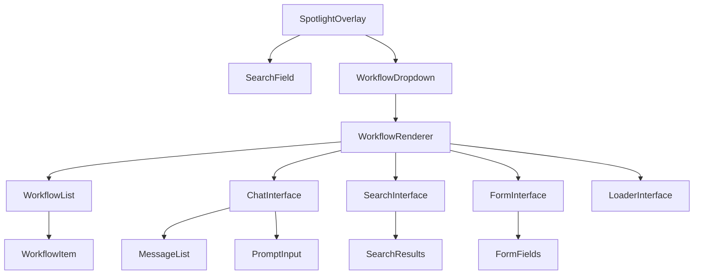

# Design Document

## Overview

The Spotlight Browser Extension is a React-based browser extension built with Plasmo that provides a macOS Spotlight-like interface for accessing configurable workflows. The extension uses a content script to inject an overlay component that responds to CMD+K keyboard shortcuts and provides keyboard navigation through various workflow options.

## Architecture

### High-Level Architecture



### Component Hierarchy



## Components and Interfaces

### Core Components

#### SpotlightOverlay

- **Purpose**: Main container component that manages the overlay state and keyboard interactions
- **Props**:
  - `isVisible: boolean`
  - `onClose: () => void`
- **State**:
  - `currentWorkflow: WorkflowPath`
  - `selectedIndex: number`
  - `searchValue: string`

#### WorkflowManager

- **Purpose**: Manages workflow navigation, state, and configuration loading
- **Methods**:
  - `loadConfig(): Promise<WorkflowConfig>`
  - `navigateToWorkflow(workflowId: string, stepData?: Record<string, any>): void`
  - `goBack(): void`
  - `getCurrentWorkflows(): Workflow[]`
  - `getBreadcrumbPath(): string`
  - `getCurrentWorkflow(): Workflow | null`
  - `isSearchEnabled(): boolean`

#### WorkflowRenderer

- **Purpose**: Dynamically renders appropriate workflow component based on type
- **Props**:
  - `workflow: Workflow`
  - `searchValue: string`
  - `selectedIndex: number`
  - `onNavigate: (workflowId: string, stepData?: Record<string, any>) => void`
  - `onBack: () => void`
  - `onClose: () => void`

#### SearchField

- **Purpose**: Input field with breadcrumb prefix display
- **Props**:
  - `prefix: string`
  - `value: string`
  - `onChange: (value: string) => void`
  - `disabled: boolean`
  - `placeholder: string`

#### ChatInterface

- **Purpose**: Chat UI for AI workflows
- **Props**:
  - `workflowType: 'ai-ask' | 'ai-agent'`
  - `onSendMessage: (message: string) => void`
- **State**:
  - `messages: ChatMessage[]`
  - `inputValue: string`

### Data Models

#### WorkflowConfig

```typescript
interface WorkflowConfig {
  workflows: Record<string, Workflow>;
  initialWorkflows: string[];
}

interface Workflow {
  id: string;
  name: string;
  type:
    | "action"
    | "navigation"
    | "chat"
    | "search"
    | "form"
    | "loader"
    | "list";
  component: string;
  children?: string[];
  action?: string;
  searchEnabled?: boolean;
  searchPlaceholder?: string;
  data?: Record<string, any>;
  nextWorkflow?: string;
}

interface WorkflowStep {
  workflowId: string;
  stepData?: Record<string, any>;
  displayName?: string;
}

interface WorkflowPath {
  steps: WorkflowStep[];
  current: string;
}

interface ChatMessage {
  id: string;
  content: string;
  sender: "user" | "ai";
  timestamp: Date;
}

interface WorkflowComponentProps {
  workflow: Workflow;
  searchValue: string;
  selectedIndex: number;
  onNavigate: (workflowId: string, stepData?: Record<string, any>) => void;
  onBack: () => void;
  onClose: () => void;
  onUpdateSearch: (value: string) => void;
}
```

### Keyboard Event Handling

#### KeyboardManager

- **Purpose**: Centralized keyboard event handling
- **Events**:
  - `CMD+K`: Toggle overlay visibility
  - `ArrowUp/ArrowDown`: Navigate options
  - `Enter`: Select current option
  - `Escape`: Go back or close

## Data Models

### Configuration Structure

The workflow configuration will be stored in `workflow-config.json`:

```json
{
  "workflows": {
    "ai-ask": {
      "id": "ai-ask",
      "name": "AI Ask",
      "type": "chat",
      "component": "ChatInterface",
      "searchEnabled": false
    },
    "ai-agent": {
      "id": "ai-agent",
      "name": "AI Agent",
      "type": "chat",
      "component": "ChatInterface",
      "searchEnabled": false
    },
    "search-users": {
      "id": "search-users",
      "name": "Search Users",
      "type": "search",
      "component": "SearchInterface",
      "searchEnabled": true,
      "searchPlaceholder": "Type to search users...",
      "nextWorkflow": "user-details"
    },
    "user-details": {
      "id": "user-details",
      "name": "User Details",
      "type": "form",
      "component": "FormInterface",
      "searchEnabled": false
    },
    "close": {
      "id": "close",
      "name": "Close",
      "type": "action",
      "action": "close"
    }
  },
  "initialWorkflows": ["ai-ask", "ai-agent", "search-users", "close"]
}
```

### State Management

#### Global State

- `overlayVisible: boolean` - Controls overlay visibility
- `currentWorkflowPath: WorkflowPath` - Tracks current navigation state
- `selectedIndex: number` - Currently selected option index
- `workflowConfig: WorkflowConfig` - Loaded configuration

#### Chat State (per workflow)

- `messages: ChatMessage[]` - Chat history
- `inputValue: string` - Current input text
- `isLoading: boolean` - Message sending state

## Error Handling

### Configuration Loading

- **Error**: Config file not found or invalid JSON
- **Handling**: Fall back to default configuration with basic workflows
- **User Feedback**: Console warning, continue with defaults

### Keyboard Event Conflicts

- **Error**: CMD+K conflicts with existing page shortcuts
- **Handling**: Use event.preventDefault() and stopPropagation()
- **Fallback**: Provide alternative activation method

### Workflow Navigation

- **Error**: Invalid workflow ID or missing component
- **Handling**: Log error and return to previous valid state
- **User Feedback**: Show error message in overlay

### Chat Interface

- **Error**: Message sending fails
- **Handling**: Show retry option and maintain message in input
- **User Feedback**: Display error indicator next to failed message

## Testing Strategy

### Unit Testing

- **Components**: Test each React component in isolation
- **Workflow Manager**: Test navigation logic and state management
- **Keyboard Manager**: Test event handling and key combinations
- **Config Loader**: Test configuration parsing and validation

### Integration Testing

- **Workflow Navigation**: Test complete navigation flows
- **Keyboard Interactions**: Test full keyboard navigation sequences
- **Chat Functionality**: Test message sending and display

### End-to-End Testing with Playwright MCP

- **Overlay Activation**: Test CMD+K opens overlay with focus on search field
- **Keyboard Navigation**: Test arrow keys, enter, and escape functionality
- **Workflow Execution**: Test each workflow type (action, chat)
- **Multi-step Navigation**: Test breadcrumb display and back navigation
- **Chat Interface**: Test message input, sending, and display

### Browser Compatibility Testing

- **Chrome**: Primary target browser
- **Firefox**: Secondary browser support
- **Safari**: Tertiary browser support (if time permits)

### Performance Testing

- **Overlay Rendering**: Ensure smooth animation and quick display
- **Keyboard Response**: Test responsiveness of keyboard interactions
- **Memory Usage**: Monitor extension memory footprint

## Implementation Notes

### Plasmo Framework Integration

- Use Plasmo's content script injection for overlay mounting
- Leverage Plasmo's live reload for development efficiency
- Utilize Plasmo's TypeScript configuration

### Styling Approach

- Use CSS modules or styled-components for component styling
- Implement Apple Spotlight-inspired design system
- Ensure proper z-index layering for overlay display
- Use CSS transitions for smooth animations

### Future AI Integration Points

- Abstract AI service interface for easy model swapping
- Implement message streaming for real-time responses
- Add configuration options for different AI providers
- Design extensible prompt template system
